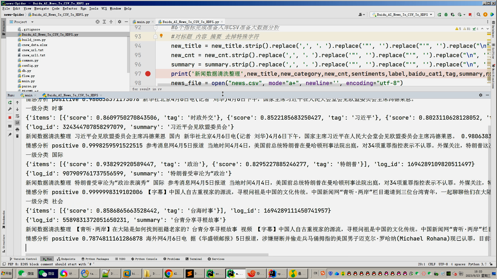

## 计算机毕业设计吊炸天hadoop+spark+hive新闻数据分析可视化大屏 知识图谱新闻推荐系统 新闻爬虫 新闻大数据 新闻语料分析 新闻情感分析 大数据毕设大数据毕设 深度学习 机器学习 大数据 大数据毕业设计 机器学习 预测系统 数据仓库 大数据毕业设计 文本分类 LSTM情感分析 大数据毕业设计 知识图谱 大数据毕业设计 预测系统 实时计算 离线计算 数据仓库 人工智能 神经网络

## 要求
### 源码有偿！一套(论文 PPT 源码+sql脚本+教程)

### 
### 加好友前帮忙start一下，并备注github有偿hive旅游数仓+推荐
### 我的QQ号是2827724252或者798059319或者 1679232425或者微信:bysj2023nb

# 

### 加qq好友说明（被部分 网友整得心力交瘁）：
    1.加好友务必按照格式备注
    2.避免浪费各自的时间！
    3.当“客服”不容易，repo 主是体面人，不爆粗，性格好，文明人。

基础版，也就是当前下面连接这个版本(只带hadoop spark hive flask Python爬虫 echarts大屏可视化驾驶舱)

https://www.bilibili.com/video/BV14j411q7Vj/?spm_id_from=333.999.0.0

## 开发技术：
spark hadoop hive 装杯显摆虚拟机Linux敲命令炫酷吊打 flask echarts sqoop scala hdfs yarn mysql python爬虫框架等；

## 流程： 

1.使用Python采集新闻数据约10万条存入mysql数据库;

2.使用pandas+numpy或者hadoop+mapreduce进行数据清洗，尝试用深度学习的分析模型对新闻语料、情感、数据标注等进行大模型分析，最终结果保存为.csv文件并上传hdfs;

3.使用hive建库建表，导入.csv文件作为数据集；

4.一半分析指标使用hive_sql完成，一半分析指标使用Spark之Scala完成；

5.对分析的结果使用sqoop导入mysql数据库；

6.使用Flask+echarts构建炫酷吊炸天大屏可视化界面；

## 创新点：
1大屏 2Python爬虫 3深度学习自然语言处理分析 4海量百万数据随时可爬 5实时计算+离线计算全部实现

## 干死中国导师王八杂种玩意，天天炸片国家补贴，技术为0，吹牛逼第一靠狗一样的存在
## 他妈比做个毕设杂种导师喷天喷地司马绝种一样

## 可选装项目模块如下：
1.推荐系统(4种深度学习推荐算法 协同过滤基于用户 基于物品 SVD神经网络 MLP)。附带AI、支付、短信、lstm情感分析。
2.预测系统(KNN CNN RNN卷积神经预测 K-means 线性回归)。
3.知识图谱neo4j可视化关系网络图。
4.后台管理系统。

## 注意：如果还觉得本系统太简单太low工作量不够，可以选装推荐系统、知识图谱、预测系统、后台管理啊，可以无缝衔接0秒对接上！！！实现效果如下：

https://www.bilibili.com/video/BV1WG411o7sZ/?spm_id_from=333.999.0.0

